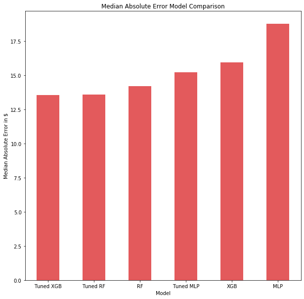

# AIRBNB-cognitivo
Airbnb é um serviço online comunitário para as pessoas anunciarem, descobrirem e reservarem acomodações e meios de hospedagem.

## Usando
Para utilizar esse repositório, com  seu Jupyter Notebook instalado clone o repositório, extraia as informações  e aplique no seu diretório de desenvolvimento.

```
https://github.com/johndelara1/AIRBNB-cognitivo.git
```

## Desafio
Nosso dataset é uma extração de dados do Airbnb Rio de
Janeiro, conforme fonte:
http://insideairbnb.com/get-the-data.html.
Ele permite três tipos de modelagem, e você pode escolher
apenas uma delas, a qual se sinta mais confortável. As três
possíveis variáveis respostas são:

    ● Previsão do preço da estadia (feature ‘price’)
    ● Classificação do room type (feature ‘room_type’)
    ● Segmentação dos principais assuntos das reviews (feature review_scores_rating’)
    
Faça uma análise exploratória para avaliar a consistência
dos dados e identificar possíveis variáveis que impactam
sua variável resposta.
Para a realização deste teste você pode utilizar o software
de sua preferência (Python ou R), só pedimos que
compartilhe conosco o código fonte (utilizando um
repositório git).

Além disso, inclua um arquivo README.md
onde você deve cobrir as respostas para os 5 pontos abaixo:
O DESAFIO


#### a. Como foi a definição da sua estratégia de modelagem?
    Com algumas análises descritivas para entender o comportamento da variável resposta (Preço). Para não termos problemas com overfitting os dados de variáveis categóricas, foram ajustadas nas mesmas proporções, verifiquei a multicolinearidade para que não tenhamos problemas com variáveis independentes que possuem relações lineares exatas ou aproximadamente exatas, depois dos devidos cortes, podemos seguir para a modelagem.     
     
#### b. Como foi definida a função de custo utilizada?
    Avaliamos esse modelo no conjunto de testes, usando o erro absoluto médio para medir o desempenho do modelo. Também incluiremos o erro quadrático médio quadrado (RMSE) para fins de integridade.
#### c. Qual foi o critério utilizado na seleção do modelo final?
    O critério utilizado foi MAE (mediana do erro absoluto), é a distância interquartilica tendo em vista que temos uma distribuição com presença de valores altamente alarmantes. Assim podemos verificar qual modelo, com dados de tese, apresenta melhor capacidade de se adaptar aos mais comuns.
#### d. Qual foi o critério utilizado para validação do modelo? Por que escolheu utilizar este método?
    Pesquisa aleatória com validação cruzada e Pesquisa em grade com validação cruzada, Escolhi esses metodos porque podemos melhorar os resultados com alguns ajustes no hiperparâmetro. Existem dois métodos principais disponíveis para isso:
    1.Random search
    2.Grid search
        Você precisa fornecer uma grade de parâmetros para esses métodos. Em seguida, os dois tentam diferentes combinações de parâmetros na grade que você forneceu. Mas o primeiro tenta apenas várias combinações, enquanto o segundo tenta todas as combinações possíveis com a grade que você forneceu.
        Eu começei com Random search para avaliar aproximadamente uma boa combinação de parâmetros. Feito isso, usei Grid search para obter resultados mais precisos.
#### e. Quais evidências você possui de que seu modelo é suficientemente bom?
    Primeiro, foi feito o pré-processamento dos dados para remover quaisquer recursos redundantes e reduzir a esparsidade dos dados. Em seguida, apliquei três algoritmos diferentes, inicialmente com parâmetros padrão que depois ajustamos. Em nossos resultados, a Randon Forest ajustado e o XGBoost ajustado tiveram o melhor desempenho, através do das medidas de RMSE (Raiz quadrada do erro-médio) e MAE (Median Absolute Error), bem como mostra no gráfico abaixo:




> Atividade construtiva, para identificar uma análise aprofundada do `AIRBNB`.
